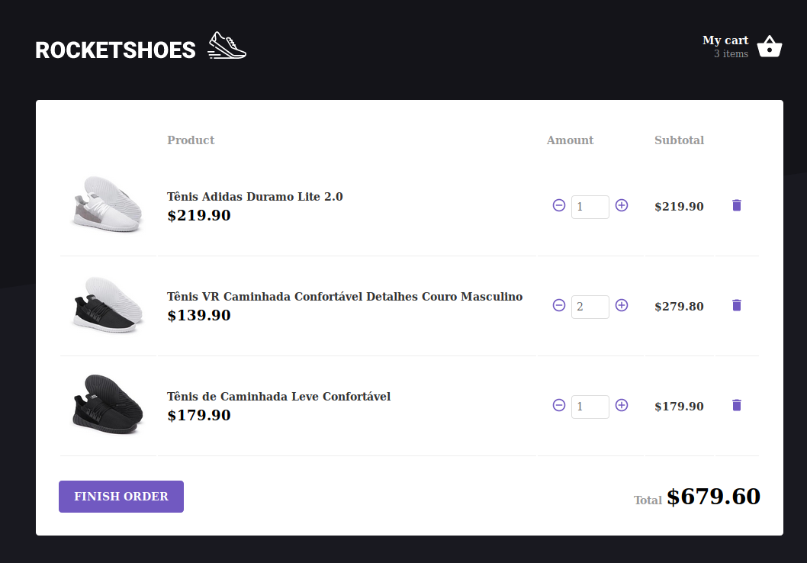
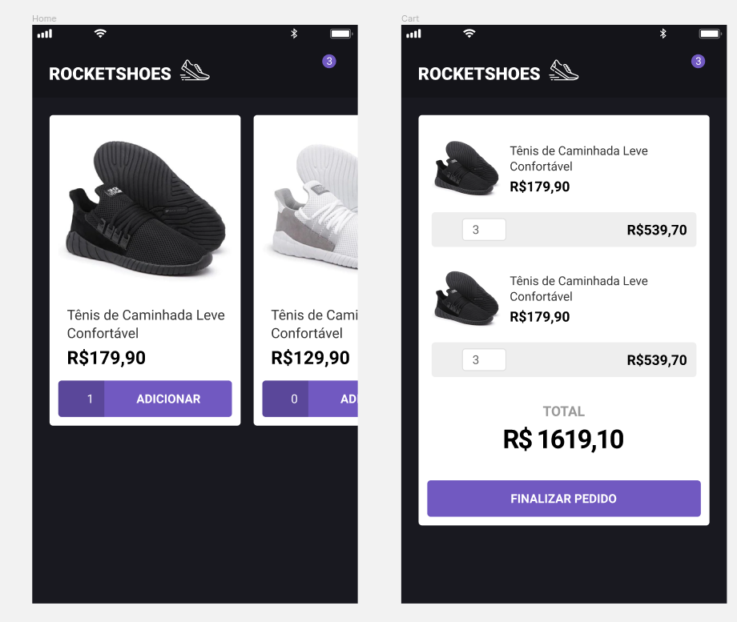

# Rocketshoes

## Web

    
    

## Mobile

    

# About

ReactJS and React Native apps that uses `Redux` and `Redux Saga` to manage the state of a shopping cart in multiple components.

In this app you can:
- Browse items
- Add items to cart
- Change the amount of each item in the cart
- Remove items from cart

It was also configured to debug with [Reactotron](https://github.com/infinitered/reactotron). Everytime an action is dispatched either to the store or saga, it will log the data in Reactotron's desktop app.
